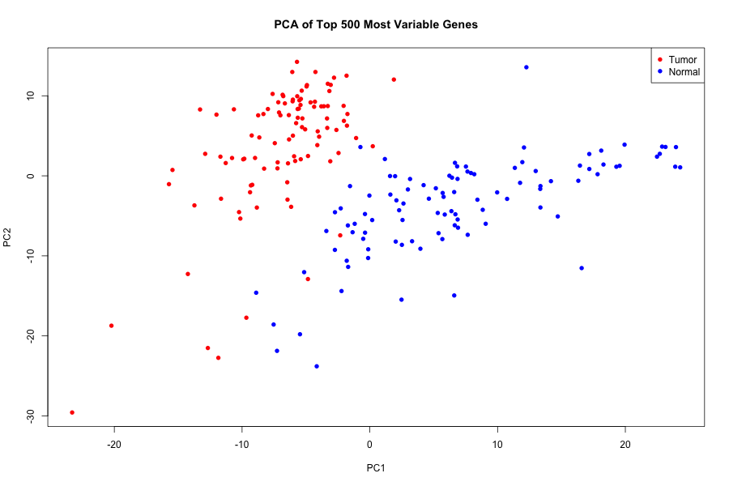
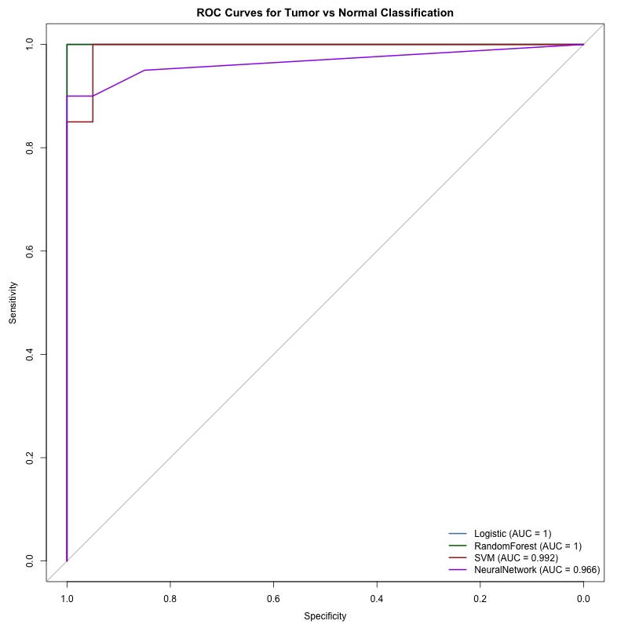
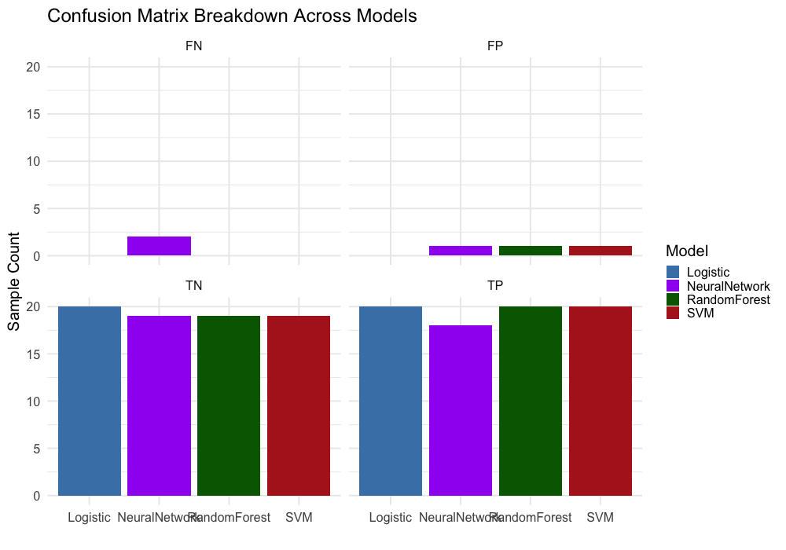
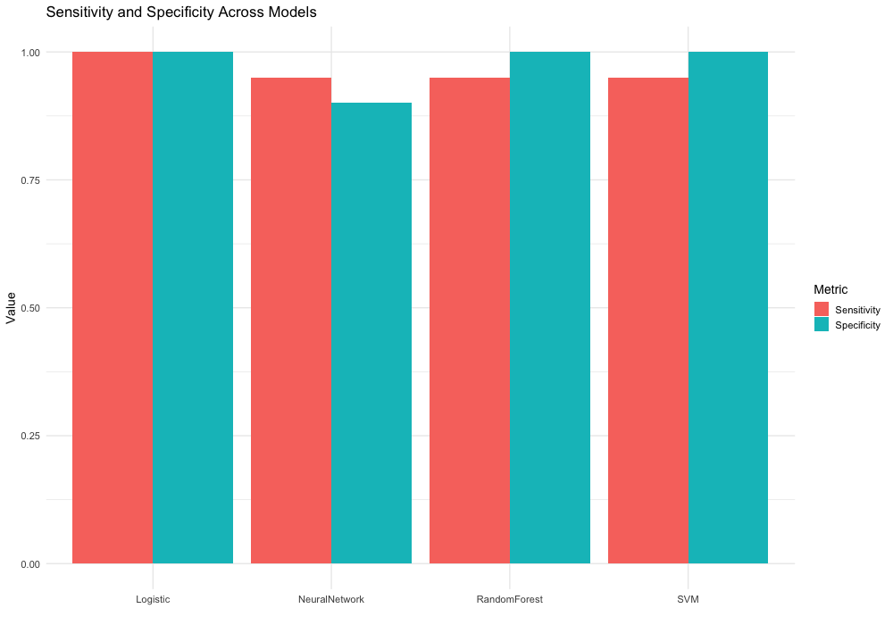

TCGA-BRCA RNA-seq Classification Analysis
================
Annie Stevenson
Last update: 09 February, 2026

<style>
pre code, pre, code {
  white-space: pre !important;
  overflow-x: auto !important;
  word-break: keep-all !important;
  word-wrap: initial !important;
}
body {
text-align: justify}
</style>

------------------------------------------------------------------------

## Overview

This analysis explores the use of RNA-seq gene expression data from the
The Cancer Genome Atlas Breast Invasive Carcinoma (TCGA-BRCA) collection
to classify primary breast cancer tumors versus normal breast tissue.
Multiple machine learning models (logistic regression, random forest,
radial SVM, and neural network) were trained and evaluated using a
standardized preprocessing/feature selection pipeline to assess
classification performance.

RNA-seq data was obtained from the TCGA-BRCA project \[1\]. After
downsampling for memory constraints, the dataset used for this analysis
includes 100 primary tumor and 100 solid tissue normal samples.

``` r
library(SummarizedExperiment)

se <- readRDS("data/processed/brca_se.rds")

table(colData(se)$sample_type)
```

    ## 
    ##       Primary Tumor Solid Tissue Normal 
    ##                 100                 100

## Exploratory Data Analysis

After downloading the data, filtering steps were performed so that only
protein-coding genes were retained. Additionally, genes with low
correlation across samples were removed, followed by quantile-based
filtering to remove lowly expressed genes. Differential expression
analysis was performed on the filtered set of genes. The top 500 most
variable differentially expressed genes (logFC \>= 1, padj \<= 0.01)
were selected for an exploratory PCA to assess the use of these genes as
features in our model. We can see in the plot below the tumor and normal
tissue groups appear to form relatively distinct clusters, indicating
the selected genes capture substantial variance between tumor and normal
tissue samples. This is an indication that the top 500 most variable DE
genes provide a strong discriminatory signal between normal and tumor
tissue samples, and will be good features to use for modeling.



## Feature Selection

Feature selection was performed exclusively on the training set to
prevent information leakage. First, the top 500 most variable genes were
selected from the training dataset. Then, differential expression
analysis was performed on the training dataset. The differentially
expressed genes that were also in the top 500 most variable gene dataset
were chosen as features for the models (N = 324).

``` r
selected_genes <- readRDS("data/model_inputs/selected_genes.rds")
length(selected_genes)
```

    ## [1] 324

Among the DEGs that were selected as model features, the three genes
with the lowest p-values were SPARCL1, ANXA1, and AQP1. All three of
these genes have been previously reported in the context of breast
cancer \[2-5\]. While expression patterns for these genes vary across
studies and experimental contexts, their established involvement in
cancer-related processes in the literature supports the biological
relevance of the selected feature set \[2-5\]. An important note: these
observations are being presented as a validation of the feature
selection strategy, and not as independent biological findings.

``` r
library(tidyverse)
library(biomaRt)

DEGs <- readRDS("data/model_inputs/DEGs_train.rds")

top_genes <- DEGs %>%
arrange(adj.P.Val) %>%
head(3)

# clean up ENSEMBL IDs
top_genes <- DEGs %>%
  arrange(adj.P.Val) %>%
  head(3) %>%
  mutate(ensembl_id = gsub("\\..*", "", rownames(.)))

# connect to ENSEMBL
ensembl <- useEnsembl(
  biomart = "genes",
  dataset = "hsapiens_gene_ensembl"
)

# fetch gene annotations
gene_info <- getBM(
  attributes = c(
    "ensembl_gene_id",
    "hgnc_symbol",
    "gene_biotype",
    "description",
    "chromosome_name"
  ),
  filters = "ensembl_gene_id",
  values = top_genes$ensembl_id,
  mart = ensembl
)

# join back to top gene results
top_genes_annotated <- top_genes %>%
  left_join(gene_info, by = c("ensembl_id" = "ensembl_gene_id"))

top_genes_annotated
```

    ##       logFC   AveExpr         t      P.Value    adj.P.Val        B
    ## 1 -182.6732 179.21422 -17.72091 1.680089e-39 8.400443e-37 2.530282
    ## 2 -141.5303 106.14154 -17.25412 2.773302e-38 6.933255e-36 2.394029
    ## 3 -119.3093  94.85265 -16.31547 8.356858e-36 1.392810e-33 2.102262
    ##        ensembl_id hgnc_symbol   gene_biotype
    ## 1 ENSG00000152583     SPARCL1 protein_coding
    ## 2 ENSG00000135046       ANXA1 protein_coding
    ## 3 ENSG00000240583        AQP1 protein_coding
    ##                                                          description
    ## 1                   SPARC like 1 [Source:HGNC Symbol;Acc:HGNC:11220]
    ## 2                       annexin A1 [Source:HGNC Symbol;Acc:HGNC:533]
    ## 3 aquaporin 1 (Colton blood group) [Source:HGNC Symbol;Acc:HGNC:633]
    ##   chromosome_name
    ## 1               4
    ## 2               9
    ## 3               7

## Model Training and Evaluation

Models were trained using 5-fold cross validation optimized for ROC, and
then evaluated on a held out test set. Sample classes were perfectly
balanced in training (40 tumor samples, 40 normal tissue samples) and
testing (10 tumor samples, 10 normal tissue samples) datasets to
eliminate class bias in performance metrics. Performance was assessed
using ROC curves, area under the curve (AUC), confusion matrices,
sensitivity, and specificity.

``` r
library(pROC)

auc_table <- readRDS("results/models/auc_summary.rds")
auc_table
```

    ##           Model     AUC
    ## 1      Logistic 1.00000
    ## 2  RandomForest 1.00000
    ## 3           SVM 0.99250
    ## 4 NeuralNetwork 0.96625

 

Below is a plot that summarizes
confusion matrix results across the four models evaluated on the testing
set (N = 20).

 

Here we can see the
sensitivity and specificity in table format and summarized in a bar plot
for all models evaluated.

``` r
sense_and_spec <- readRDS("results/models/sensitivity_specificity.rds")

sense_and_spec
```

    ##           Model Sensitivity Specificity
    ## 1      Logistic        1.00         1.0
    ## 2  RandomForest        0.95         1.0
    ## 3           SVM        0.95         1.0
    ## 4 NeuralNetwork        0.95         0.9



All models achieved strong discrimination between tumor and normal
samples. The logistic regression model had perfect performance, while
the random forest and radial SVM models had nearly perfect performance
with each having 1 false positive. The neural network model had the
worst performance of the models evaluated, with two false negatives and
one false positive (sensitivity = 0.95, specificity = 0.9). Typically,
machine learning performance metrics this high warrant scrutiny due to
concerns regarding overfitting or information leakage. However, tumor
tissue is characterized by widespread transcriptional dysregulation
relative to normal tissue, which results in strong global expression
differences. This is reflected in the clear separation observed during
PCA using the top variable genes, suggesting that the high
classification performance is driven by biologically meaningful signal
rather than model artifact.

Overall, these results suggest that RNA-seq expression profiles contain
sufficient signal for accurate tissue classification. This analysis uses
a downsampled subset of TCGA-BRCA samples, which may limit
generalizability. Additionally, this project was not intended to be a
comprehensive biological investigation, but rather as a demonstration of
end-to-end RNA-seq preprocessing, feature selection, and machine
learning model evaluation. Future work could include extending this
analysis to the full dataset, or incorporating more hyperparameter
tuning.

**References:**

1.  Lingle, W., Erickson, B. J., Zuley, M. L., Jarosz, R., Bonaccio, E.,
    Filippini, J., Net, J. M., Levi, L., Morris, E. A., Figler, G. G.,
    Elnajjar, P., Kirk, S., Lee, Y., Giger, M., & Gruszauskas, N.
    (2016). The Cancer Genome Atlas Breast Invasive Carcinoma Collection
    (TCGA-BRCA) (Version 3) \[Data set\]. The Cancer Imaging Archive.
    <https://doi.org/10.7937/K9/TCIA.2016.AB2NAZRP>

2.  Xu XY, Han YW, Song YX, Zhou ZY, Chen S, Liu YW, Zhou Y, Chen J.
    Profile and clinical significance of SPARCL1 and its prognostic
    significance in breast cancer. Oncol Lett. 2025 Feb 24;29(4):196.
    doi: 10.3892/ol.2025.14942. PMID: 40046638; PMCID: PMC11880884.

3.  Moraes, L.A., Kar, S., Foo, S.L. et al. Annexin-A1 enhances breast
    cancer growth and migration by promoting alternative macrophage
    polarization in the tumour microenvironment. Sci Rep 7, 17925
    (2017). <https://doi.org/10.1038/s41598-017-17622-5>

4.  Traberg-Nyborg L, Login FH, Edamana S, Tramm T, Borgquist S, Nejsum
    LN. Aquaporin-1 in breast cancer. APMIS. 2022 Jan;130(1):3-10. doi:
    10.1111/apm.13192. Epub 2021 Nov 23. PMID: 34758159.
